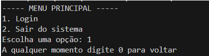
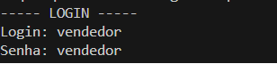
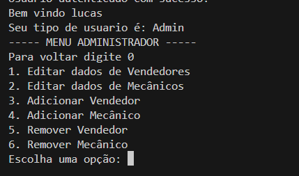
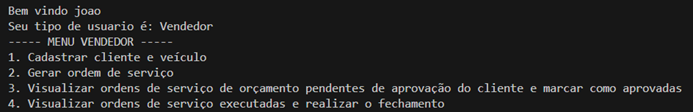
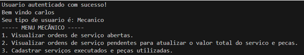
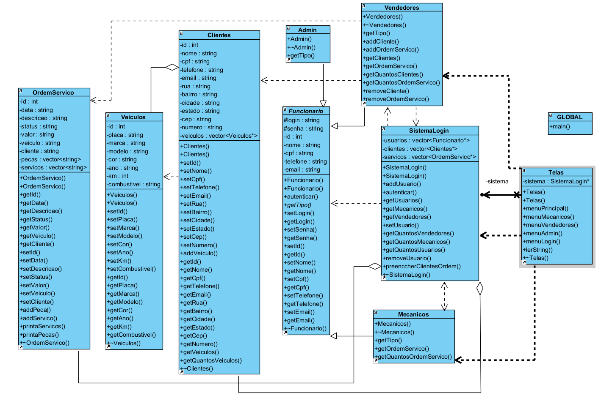

# Sistema de Gerenciamento de Oficina Mecânica

Este projeto é um sistema de gerenciamento para uma oficina mecânica, desenvolvido em C++. O objetivo é otimizar o fluxo de trabalho da oficina, desde o cadastro de clientes e veículos até a administração de ordens de serviço. A aplicação foi desenvolvida utilizando os conceitos de Programação Orientada a Objetos (POO) para garantir um código modular, coeso e com baixo acoplamento.
Consulte o relatório na pasta `docs`.

## 📸 Tela do Programa

                        Tela Menu inicial e de Login:

  
  

Tela do ADMIN:

  

Tela do Vendedor:

  

Tela do Mecanico:

  

## ✨ Funcionalidades

O sistema possui três perfis de usuário com diferentes níveis de acesso e funcionalidades:

### 👨‍💼 Administrador

O administrador é responsável pela gestão dos funcionários do sistema.

- Adicionar, editar e remover Vendedores.
- Adicionar, editar e remover Mecânicos.

### 👨‍🔧 Vendedor

O vendedor gerencia o relacionamento com o cliente e as ordens de serviço.

- Cadastrar novos clientes e seus respectivos veículos.
- Gerar novas ordens de serviço, que podem ser um orçamento ou um serviço com valor definido.
- Visualizar orçamentos pendentes de aprovação do cliente.
- Realizar o fechamento de ordens de serviço que já foram executadas pelos mecânicos.

### 🛠️ Mecânico

O mecânico é responsável pela parte técnica e execução dos serviços.

- Visualizar todas as ordens de serviço abertas (pendentes e aprovadas).
- Atualizar ordens pendentes com os valores de peças e serviços para gerar um orçamento.
- Registrar os serviços executados e as peças utilizadas em uma ordem de serviço aprovada.

## 🚀 Tecnologias Utilizadas

- **Linguagem:** C++
- **Compilação:** Makefile com MinGW (para Windows)
- **Modelagem:** Astah UML para o diagrama de classes.

## ⚙️ Como Compilar e Executar

### Pré-requisitos

- **Windows:** É necessário ter o MinGW instalado. Durante a instalação, garanta que os pacotes `mingw32-base` e `mingw32-gcc-g++` estejam selecionados.
- **Linux:** O `make` já é nativo na maioria das distribuições.

### Passos

1.  **Compilação:**
    - Navegue até a raiz do projeto pelo terminal e execute o comando: `mingw32-make` ou `make`
2.  **Execução:**
    - Após a compilação, acesse a pasta `bin` e execute o arquivo `main`.

## 🔑 Dados de Login

O sistema inicia com usuários padrão para facilitar o teste:

- **Administrador:**
  - **Login:** `admin`
  - **Senha:** `admin`
- **Vendedor:**
  - **Login:** `vendedor`
  - **Senha:** `vendedor`
- **Mecânico:**
  - **Login:** `mecanico`
  - **Senha:** `mecanico`

## 🏗️ Estrutura e Conceitos Aplicados

O projeto foi estruturado utilizando os pilares da **Programação Orientada a Objetos**:

- **Herança:** A classe `Funcionario` serve como base para as classes `Admin`, `Mecanicos` e `Vendedores`.
- **Polimorfismo:** Utilizado através de métodos virtuais como `getTipo()`, que possui implementações específicas em cada subclasse de `Funcionario`.
- **Encapsulamento:** Acesso a atributos sensíveis é controlado por meio de métodos públicos, protegendo os dados internos das classes.
- **Abstração:** Classes como `Veiculos`, `Clientes` e `OrdemServico` representam entidades do mundo real de forma simplificada, focando em suas características essenciais.

Um diagrama UML detalhado, ilustrando a relação entre todas as classes, está disponível abaixo.

